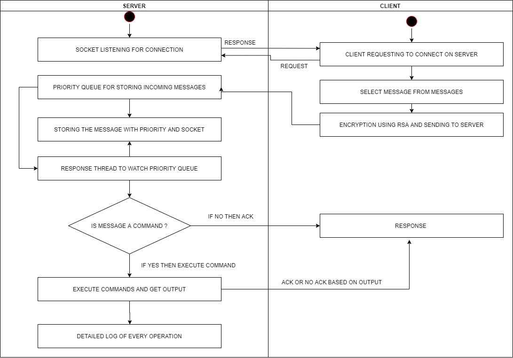

# CLI-chat-interface
A small internet chat interface on java for handling multiple client requests.

#### Steps To Run The Project on Linux: 

```sh
1. Just open the file.sh file included in the repository and execute the file.
2. It will open 1 server and 10 clients by default and run the instances of terminals.
3. To change the number of clients, you can change the count of clients in the file.sh file includes in the root.
4. Output can be seen in the server terminal and the responses can be seen in the client terminals.
5. A delay of 1000ms is imposed on response thread each time so as to show the priority queue working.
```

#### Steps To Run The Project on Windows: 

```sh
1. Un-Comment the Code from line 26 till 30 in file ServerCode.java
2. Execute the file ServerCode.java
3. It will open 1 server and 10 clients by default and run the instances of terminals.
4. To change the number of clients, you can change the count of for loop in ServerCode.java file.
5. Output can be seen in the server terminal and the responses can be seen in the client terminals.
6. A delay of 1000ms is imposed on response thread each time so as to show the priority queue working.
```




This chat interface is being implemented using Java socket programming. This is one server serving to any number of clients connecting to the server. The features included in the system are as follows:

1. One worker hearing for new connections from the clients incoming. Any number of clients can be connected.

2. The incoming messages from clients can be either a text message or linux commands. The message can be sent as a command to be executed.

3. All the incoming messages will be responded as ACK for the simple text messages and successfully executed commands and NO ACK for the failed commands. The messages will be randomly selected from messages.txt file

4. The incoming clients can constantly interact with the server and send input messages. These messages will be sent with the help of RSA encryption which will be decrypted at the server end.

5. The messages sent by the client would be stored in a priority queue and as per the priority defined by the client for each message.

6. A separate thread is constantly hearing on the priorityqueue to check if there is any element introduced in the priority queue to be executed and responded with ACK or NO ACK.

7. The speed of the system is efficient because all the incoming requests of messages are constantly being monitored by multiple listening threads on the single server cloud. Also the response thread is a separate thread so as the load of incoming and outgoing requests can be distributed.

8. All the commands are executed in any Operating System and the response of the execution is checked and client is given the reply as ACK or NO ACK. 

9. The detailed log of everything is dumped in the log files created in the log Files folder by Logger class of Java.
